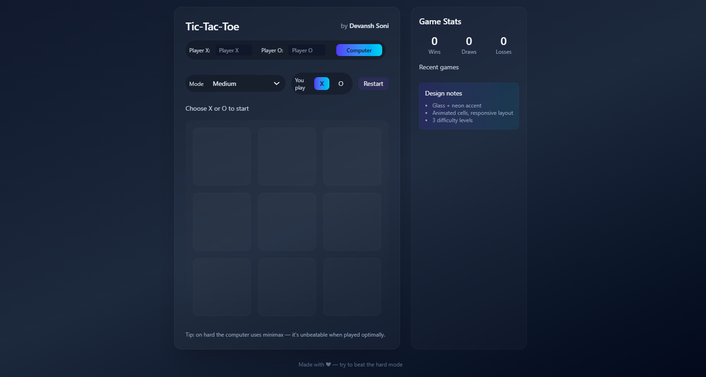

# 🎮 Tic-Tac-Toe Game (Task 3)

This is my **3rd project** of the **Web Development Internship** at **SkillCraft Technology**.  
I built an interactive **Tic-Tac-Toe game** with **Player vs Computer (AI)** and **Player vs Player** modes.

---

## 🚀 Features

- ✅ Player vs Computer (AI)  
  - Easy → Random moves  
  - Medium → Mix of random + smart moves  
  - Hard → **Unbeatable Minimax algorithm**  
- ✅ Player vs Player (PvP) toggle  
- ✅ Custom player name input  
- ✅ Game stats (Wins / Draws / Losses)  
- ✅ Recent game history with timestamps  
- ✅ Responsive UI with **TailwindCSS + Glassmorphism**  
- ✅ Keyboard support → use `1–9` keys for moves  
- ✅ Restart & replay option  

---

## 🛠️ Tech Stack

- **HTML5**  
- **CSS3 (TailwindCSS + custom styles)**  
- **JavaScript (Vanilla, ES6+)**  

---

## 📂 Project Structure

├── index.html # Main HTML file
├── script.js # Game logic & AI
├── output.css # Tailwind compiled CSS
├── t-logo.png # Favicon/logo
└── README.md

---

## 🎮 How to Play

1. Open `index.html` in your browser.  
2. Choose game mode:  
   - **Computer** → play against AI  
   - **PvP** → play against a friend  
3. Pick your symbol **X or O**.  
4. Start playing! 🎉  
5. Check your stats and history in the right panel.  

---

## 📸 Screenshots

 

---

## 🎯 Learning Outcomes

- Learned how to implement **Minimax Algorithm** in JavaScript  
- Practiced building **responsive layouts with TailwindCSS**  
- Improved **DOM manipulation & event handling**  
- Created a **fun, interactive web app**  

---

## 👤 About Me  

This project was developed during my **Web Development Internship** at **SkillCraft Technology**.  
I’m exploring real-world tasks to improve my **frontend development & problem-solving skills**.

- GitHub: [Devansh-Soni1](https://github.com/Devansh-Soni1)  
- LinkedIn: [Devansh Soni](https://www.linkedin.com/in/devansh-soni-/)  